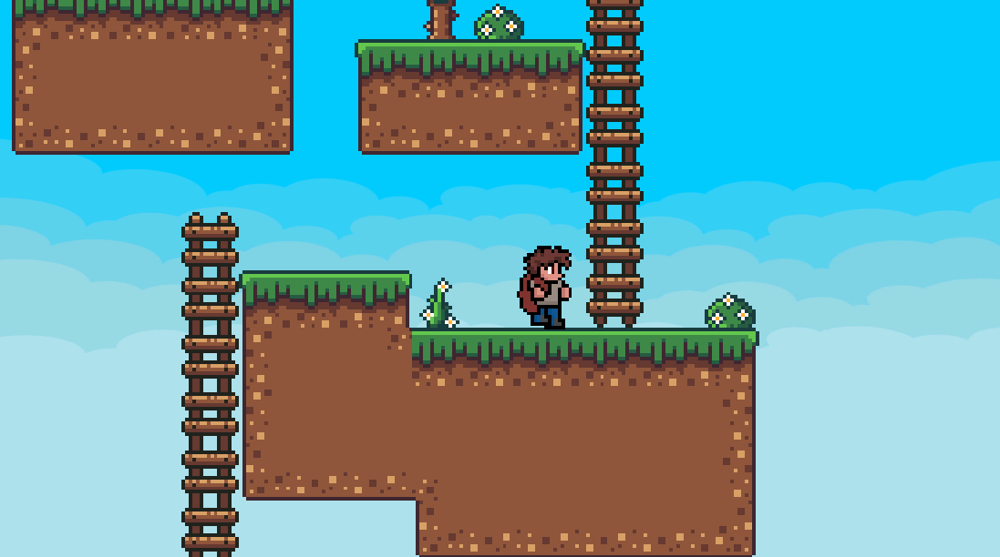

## Download
The current version of <b>Infinity-Jump</b> can be found <a href="Releases/LATEST.zip?raw=true">here</a>.

## Screenshots

## Credits

<a href="https://github.com/zManuu">Developement, UIDesign, LevelDesign, TileSet</a> 
<a href="https://github.com/Cybermork">LevelDesign</a> 
<a href="https://rottingpixels.itch.io/">TileSet</a> 
<a href="https://fontspace.com/ghielz">Font</a> 
<a href="https://icoso.itch.io/">Background Music</a>

## Trello
To stay up to date, you can watch the trello-board, just click 
<a href="https://trello.com/b/8qlJeRb4/infinityjump">here</a>
